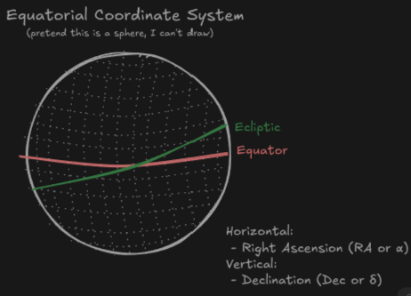

# Project Goal
Use Stellarium’s scripting engine to visually show a planet's position within its current constellation. This makes it easier to collect data for Sun & Planet Tracking in Mr. Bloom’s Astrophysics class.

# How to run
- download this repository and put sp-tracking.ssc into the script folder
	- on Linux: usr/share/stellarium/scripts
	- on Mac: ~/Library/Application Support/Stellarium/scripts
	- on Windows: C:\Users\<YourUsername>\AppData\Roaming\Stellarium\scripts\
- open Stellarium (desktop version)
- open script console (F12)
- press the folder button in the top left
- look at the filepath it shows at the top
- open your file viewer and go there
- download this repository and drag sp-tracking.ssc into that folder
- select the file in stellarium (you may need to close and reopen the file chooser menu)
- click the run button in the top right of the script console window
- note: if you change the date, re-run the script 

# Method Overview
## Coordinate System
We’re using the Equatorial Coordinate System, which maps the sky using:
- Right Ascension (RA or α) 
- Declination (Dec or δ) 

## How Do We Get Stellarium To Do All The Work Instead Of Sitting There For 5 Minutes Holding Our Hand Up To The Screen Just To Get A Different Answer Than The Guy Next To Us?
So far in class we’ve just panned around and changed a few view settings. But the desktop version of Stellarium has a scripting engine that can:
- Get the RA/Dec of any object (like a planet or the Sun)
- Tell us which constellation that object is in
- Give us the boundary coordinates of that constellation (technically this data is hardcoded into the script because i made a couple tweaks to it)
- Draw text on the screen

Using the RA/Dec values and constellation bounds, we can calculate the distance between the object and the bounds, then represent that onscreen in a familiar way.

# The Math (it’s not bad, I promise)
To figure out where a planet is in its constellation, we:
1. Get the RA/Dec of the planet
2. Get the RA/Dec of the eastern and western edges of the constellation
3. Use angular separation to see how far the planet is from each edge

Note: this does not account for how far above or below the planet is on the Ecliptic. However, the script still has an output accurate enough for our needs.
## Choosing a Formula
We need a way to calculate angular separation (θ) between two coordinate points (α₁, δ₁) and (α₂, δ₂).

Option 1: Spherical Law of Cosines  
$$\theta = \arccos(sin(\delta_1)sin(\delta_2) + cos(\delta_1)cos(\delta_2)cos(\alpha_2-\alpha_1))$$
- Simpler
- Used in the original version of the script

Option 2: Haversine Formula  
$$
\theta = 2 \arcsin(\sqrt{\sin^2(\frac{(\delta_2-\delta_1)}{2})+\cos(\delta_1)\cos(\delta_2)\sin^2(\frac{(\alpha_2-\alpha_1)}{2})})
$$
- More accurate, especially for small angles
- A bit messier to write out
- used in the latest version of the script

# The Script
Stellarium uses a scripting language that works a lot like Javascript.

The original version had a bunch of scattered functions with no organization. The updated version groups everything into classes:
- One for display stuff
- One for math/calculations
- One for coordinate conversions

The script ends up drawing the planet’s position in a way that mimics the layout of the yellow tracking sheet. 

We end up with something like this, drawn onscreen right in Stellarium

Mars
Gemini  
|     |     |  ┃  |     |  
Jupiter 
Taurus  
|     | ┃   |     |     |  
... etc

